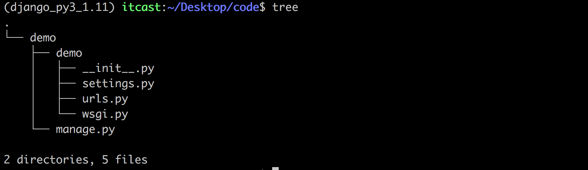
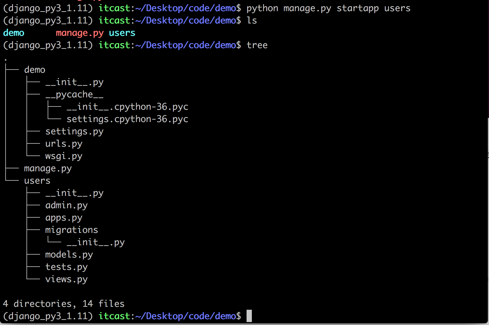

### 安装Django

`pip install django==1.11.11`

### 创建工程

`django-admin startprojet 工程名称`

### 项目目录说明



* settings.py 项目整体配置文件
* urls.py 项目的URL配置文件
* wsgi.py 项目的WSGI兼容的Web服务器入口
* manage.py 项目管理文件，通过它管理项目

### 运行项目

`python manage.py runserver ip:端口`或`python manage.py runserver` 默认端口8000

### 创建应用

`python manage.py startapp 应用名`



* admin.py 跟网站的后台管理站点配置相关
* apps.py 用于配置当前应用的相关信息
* migrations 用于存放数据库迁移历史文件
* tests.py 用于开发测试用例,编写单元测试
* views.py Web应用视图

### 注册安装应用

> 在项目的settings.py 文件中添加 `user.apps.UsersConfig `

### 创建视图

```python
from django.http import HttpResponse

def index(request):
    return HttpResponse('hello world')
```

### 定义路由

> 在应用目录下新建一个urls.py文件用于保存该应用的路由

```python
from django.conf.urls import url
from . import views


urlpatterns = [
    url(r'^index/$', views.index),
]
```

> 在项目的urls.py中注册路由

```python
from django.conf.urls import url, include
from django.contrib import admin

urlpatterns = [
    url(r'^admin/', admin.site.urls),
    url(r'^users/', include('users,urls'))
]

```

> 最终完整的路径`/users/index/`