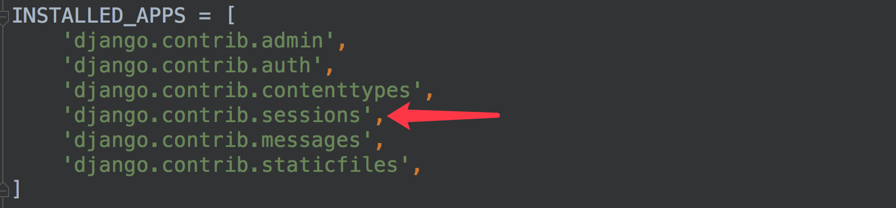

### 请求Request

1. URL路径参数

   * 未命名参数按定义顺序传递

     ```python
     # url: url(r'^weather/([a-z]+)/(\d{4})/$', views.weather)
     # /users/weather/beijing/2018
     def weather(request, city, year):
         print('city', city)
         print('year', year)
         return HttpResponse('OK')
     ```

   * 命名参数按名字传递

     ```python
     # url(r'^weather/(?P<city>[a-z]+)/(?P<year>\d{4})/$', views.weather)
     def weather(request, year, city):
         print('city', city)
         print('year', year)
         return HttpResponse('OK')
     ```

2. Django中的QueryDict对象

   > 定义在Django.http.QueryDict
   >
   > HttpRequest对象的属性GET、POST都是QueryDict类型的对象
   >
   > 与python字典不同，QueryDict类型的对象用来处理同一个键带有多个值得情况

   * get()

     > dict.get('键', 默认值)
     >
     > 如果一个 键同时拥有多个值将获取最后一个值
     >
     > 如果键不存在则返回None值，可以设置默认值进行后续处理

   * getlist()

     > dict.get('键', 默认值)
     >
     > 返回值是一个列表，可以获取所有的值
     >
     > 如果键不存在则返回空列表，可以设置默认值后续处理

3. 查询字符串Query String

   > 获取请求路径中的查询字符串参数（?k1=v1&k2=v2)，可以通过request.GET属性获取，返回QueryDict对象

   ```python
   # /qs/?a=1&b=2&a=3
   def qs(request):
       a = request.GET.get('a')
       b = request.GET.get('b')
       alist = request.GET.getlist('a')
       print(a)  # 3
       print(b)  # 2
       print(alist)  # ['1', '3']
   ```

   > 查询字符串不区分请求方式，即使客户端进行POST方式的请求，依然可以通过request.GET获取请求中的查询字符串数据

4. 请求体

   > 请求体数据格式不固定，可以使表单类型字符串，可以是JSON字符串，可以是XML字符串，应区别对待。
   >
   > 可以发送请求数据的请求方式有POST、PUT、PATCH、DELETE。
   >
   > Django默认开启了CSRF防护，会对上述请求方式进行CSRF防护验证，在测试时可以关闭防护机制，方法为在settings.py 文件中注释掉CSRF中间件

   1. 表单类型 Form Data

      > 前端发送的表单请求数据，可以通过request.POST属性获取，返回QueryDict对象

      ```python
      def get_body(request):
          a = request.POST.get('a')
          b = request.POST.get('b')
          alist = request.POST.getlist('a')
          print(a)
          print(b)
          print(alist)
          return HttpResponse('OK')
      ```

      > request.POST只能用来获取POST方式的请求表单数据
      >
      > 表单中的get数据实际为查询字符串

   2. 非表单类型Non-Form Data

      > 非表单类型的请求体数据，Django无法自动解析，可以通过request.body属性获取最原始的请求体数据，自己按照请求格式（JSON、XML等）进行解析。request.body返回bytes类型
      >
      > 如要获取请求体中的JSON数据``{"a": 1, "b": 2}`

      ```python
      import json
      def get_body_json(request):
          json_str = request.body
          json_str = json_str.decode()  # python3.6 无需执行此步
          req_data = json.loads(json_str)
          print(req_data['a'])
          print(req_data['b'])
          return HttpResponse('OK')
      ```

5. 请求头
   可以通过`request.META`属性获取请求头headers中的数据，request.META为字典类型，自定义请求头中的数据`HTTP_VALUE` `VALUE` 为请求头数据，无论大写还是小写都会被转成大写

   - `CONTENT_LENGTH` – The length of the request body (as a string).
   - `CONTENT_TYPE` – The MIME type of the request body.
   - `HTTP_ACCEPT` – Acceptable content types for the response.
   - `HTTP_ACCEPT_ENCODING` – Acceptable encodings for the response.
   - `HTTP_ACCEPT_LANGUAGE` – Acceptable languages for the response.
   - `HTTP_HOST` – The HTTP Host header sent by the client.
   - `HTTP_REFERER` – The referring page, if any.
   - `HTTP_USER_AGENT` – The client’s user-agent string.
   - `QUERY_STRING` – The query string, as a single (unparsed) string.
   - `REMOTE_ADDR` – The IP address of the client.
   - `REMOTE_HOST` – The hostname of the client.
   - `REMOTE_USER` – The user authenticated by the Web server, if any.
   - `REQUEST_METHOD` – A string such as `"GET"` or `"POST"`.
   - `SERVER_NAME` – The hostname of the server.
   - `SERVER_PORT` – The port of the server (as a string).

6. 其它HTTPRequest对象属性

   * method: 请求方法
   * user: 请求的用户对象
   * path: 请求页面的完整路径，不包含域名和参数部分
   * encoding: 提交数据的编码方式
     * 如果为None，表示使用浏览器的默认设置，一般为utf-8
     * 这个属性是可写的，可以通过修改它来访问表单数据使用的编码，接下来对属性的任何访问将使用新的encoding值
   * FILES: 一个类似于字典的对象，包含所有的上传文件。

### 响应Response

> 视图在接收请求并处理后，必须返回HttpRequest对象或子对象。HttpRequest对象有Django 创建HttpRequest子对象由开发人员创建

1. HttpRequest

   > 可以使用django.http.HttpResponse来构造响应对象

   `HttpResponse(content='响应体', content_type='响应类型', status='状态码')`

   ```python
   response = HttpResponse()
   response['Hello'] = 'Python'
   ```

   ```python
   from django.http import HttpResponse
   def demo_view(request):
       return HttpResponse('hello world', status=400)
   	# 或者
       response = HttpResponse('hello world')
       response.status_code = 400
       return response
   ```

2. HttpResponse子类

   > Django 提供设置状态码的子类

   - HttpResponseRedirect 301
   - HttpResponsePermanentRedirect 302
   - HttpResponseNotModified 304
   - HttpResponseBadRequest 400
   - HttpResponseNotFound 404
   - HttpResponseForbidden 403
   - HttpResponseNotAllowed 405
   - HttpResponseGone 410
   - HttpResponseServerError 500

3. JsonResponse

   > 若要返回json数据，可以使用JsonResponse来构造响应对象

   ```python
   from django.http import JsonResponse
   
   
   def demo_view(response):
       return JsonResponse({'city': 'beijing', 'subject': 'python'})
   ```

4. redirect重定向

   ```python
   from django.shortcuts import redirect
   
   
   def demo_view(request):
       return redirect('/index.html')
   ```

### cookie

* 设置cookie

  `HttpResponse.set_cookie(cookie名, value=cookie值, max_age=cookie有效期)`

  `max_age单位为秒，默认为None。如果是临时cookie，可将max_age设置为None`

  ```python
  def demo_view(request):
      response = HttpResponse('ok')
      response.set_cookie('hello', 'python') #临时cookie
      response.set_cookie('hello1','python1', max_age=3600)
      return response
  ```

* 获取cookie

  ```python
  def demo_view(request):
      cookie1 = request.COOKIES.get('hello')
  ```

### session

1. 启动session

   > 默认是使用session

2. 存储方式

   * 存储在数据库

     > 存储在数据库, 如下设置可写可不写，这是默认存储方式
     > `SESSION_ENGINE = 'django.contrib.sessions.backends.db'`
     > 如果在数据库中存储，需要在INSTALLED_APPS中安装Session应用

     

     > 数据库中的表

     

     > 表结构

     

   * 本地缓存

     > 缓存在本地内存中，如果丢失则不能找回，比数据库的方式读写更快

     `SESSION_ENGINE = 'django.contrib.sessions.backends.cache'`

   * 混合存储

     > 优先从本机内存中存取，如果没有则从数据库中存取

     `SESSION_ENGINE = 'django.contrib.sessions.backends.cached_db'`

   * redis

     * 安装配置
       `pip install django-redis`

     * 配置

       ```python
       CACHES = {
           "default": {
               "BACKEND": "django_redis.cache.RedisCache",
               "LOCATION": "redis://127.0.0.1:6379/1",
               "OPTIONS": {
                   "CLIENT_CLASS": "django_redis.client.DefaultClient",
               }
           }，
           "session": {
               "BACKEND": "django_redis.cache.RedisCache",
               "LOCATION": "redis://127.0.0.1:6379/2",
               "OPTIONS": {
                   "CLIENT_CLASS": "django_redis.client.DefaultClient",
               }
           }
       }
       SESSION_ENGINE = "django.contrib.sessions.backends.cache" # 指定session使用缓存
       SESSION_CACHE_ALIAS = "default"  # 指定缓存在哪个空间  也可以是新创建的session
       ```

       > 如果redis的ip地址不是本地回环测试地址，而是其他地址，访问Django时，可能出现Redis连接错误
       > 解决方法是在Redis配置文件中进行配置：
       >
       > `sudo vim /etc/redis/redis.conf`
       >
       > `bind 127.0.0.1 10.211.55.5 `
       >
       > 重启redis`sudo service redis-server restart`

3. session操作

   * 设置session
     `request.session['键'] = '值'`

   * 读取session
     `request.session.get('键', '默认值')`

   * 清除所有session，在存储中删除值部分
     `request.session.clear()`

   * 清除所有session，在存储中删除整条数据

     `request.session.flush()`

   * 删除session中的指定键及值，在存储中删除键及对应的值
     `del request.session['键']`

   * 设置session的有效期
     `request.session.set_expiry('值')`

     - 如果value是一个整数，session将在value秒没有活动后过期。
     - 如果value为0，那么用户session的Cookie将在用户的浏览器关闭时过期。
     - 如果value为None，那么session有效期将采用系统默认值，**默认为两周**，可以通过在settings.py中设置**SESSION_COOKIE_AGE**来设置全局默认值。