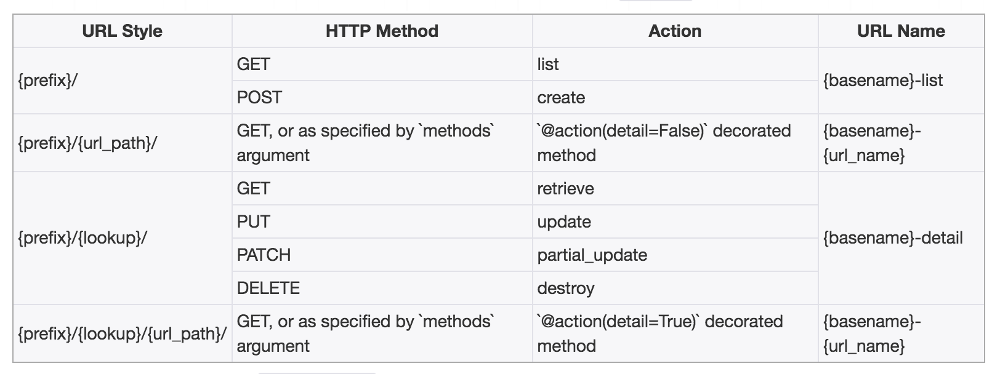

#### 视图

1. 两个基类
   **1) APIView**
   `rest_framework.views.APIView`

   `APIView`与`View`的区别

   * 传入视图方法中的REST framework的`Request`对象，而不是Django的`HttpRequest`对象
   * 视图方法可以返回REST framework的`Response`对象，视图会对响应数据设置（render）符合前端要求的格式
   * 任何`APIException`异常都会被捕获到，并且处理成合适的响应信息
   * 在进行dispatch()分发前，会对请求进行身份认证，权限检查，流量控制。

   支持定义的属性:

   * authentication_classes 列表或元组，身份认证类
   * permission_classes 列表或元组，权限检查类
   * throttle_classes 列表或元组，流量控制类

   ```python
   class BookListView(APIView):
   
       def get(self, request):
           books = BookInfo.objects.all()
           serializer = BookInfoSerializer(books, many=True)
           return Response(serializer.data)
   ```

   **2) GenericAPIView**
   `rest_framework.generics.GenericAPIView`

   > 继承自`APIView`，主要添加了操作序列化器和数据库查询的方法，作用是为Mixin扩展类的执行提供方法支持，通常在使用时，可以搭配一个或多个Mixin扩展类	

   **提供关于序列化器使用的属性与方法**

   - 属性
     `serializer_class` 指明视图使用的序列化器

   - 方法

     - `get_serializer_class(self)` 返回序列化器类，默认返回`serializer_class`, 可以重写

       ```python 
       def get_serializer_class(self):
           if self.request.user.is_staff:
               return FullAccountSerializer
           return BasicAccountSerializer
       ```

     - `get_serializer(self, *args, **kwargs)`
       返回序列化器对象，主要用来提供给Mixin扩展类使用，如果我们在视图中想要获取序列化器对象，也可以直接用此方法
       **注意** 该方法在提供序列化器对象的时候，会向序列化器对象的context属性补充三个数据: `request`、`format`、`view`这三个数据对象可以在定义序列化器时使用

     - `request` 当前视图的请求对象

     - `view` 当前请求的类视图对象

     - `format` 当前请求期望返回的数据格式


   **提供关于数据库查询的属性与方法**

   - 属性

     `queryset ` 指明使用的数据查询集

   - 方法

     - `get_queryset(self)` 
       返回视图使用的查询集，主要用来提供给Mixin扩展类使用，是列表视图与详情视图获取数据的基础，默认返回`queryset`属性，可以重写

       ```python
       def get_queryset(self):
           user = self.request.user
           return user.accounts.all()
       ```

     - `get_object(self)`
       返回详情视图所需要的模型类数据对象，主要用来提供给Mixin扩展类使用。在视图中可以调用该方法获取详情信息的模型对象。

   **若详情访问的模型类对象不存在，会返回404**

   该方法会默认使用APIView提供的`check_object_permissions`方法检查当前对象是否有权限被访问

   ```python
   class BookDetailView(GenericAPIView):
       queryset = BookInfo.objects.all()
       serializer_class = BookInfoSerializer
       def get(self, request, pk):
           book = self.get_object()
           serializer = self.get_serializer(book)
           return Response(serializer.data)
   ```

   **其它属性和方法**

   - pagination_class 指明分页控制类
   - filter_backends 指明过滤控制后端

2. 五个扩展类

   > 作用：
   >
   > 提供了几种后端视图（对数据资源进行曾删改查）处理流程的实现，如果需要编写的视图属于这五种，则视图可以通过继承相应的扩展类来复用代码，减少自己编写的代码量。
   >
   > 这五个扩展类需要搭配GenericAPIView父类，因为五个扩展类的实现需要调用GenericAPIView提供的序列化器与数据库查询的方法。

   **1) ListModelMixin**

   列表视图扩展类，提供`list(request, *args, **kwargs)` 方法快速实现列表视图，返回状态码200，该Mixin的list方法会对数据进行过滤和分页

   ```python
   class BookListView(GenericAPIView, ListModelMixin):
       queryset = BookInfo.objects.all()
       serializer_class = BookInfoSerializer
       def get(self, request):
           return self.list(request)
   ```

   **2) CreateModelMixin**

   创建视图扩展类，提供`create(request, *args, **kwargs)`方法快速实现创建资源的视图，成功返回201状态码
   如果序列化器对前端发送的数据验证失败，返回400错误
   **3) RetrieveModelMixin**

   详情视图扩展类，提供`retrieve(request, *args, **kwargs)` 方法，可以快速实现返回一个存在的数据对象，如果存在返回200.否则返回404

   ```python
   class BookDetailView(GenericAPIView, RetrieveModelMixin):
       queryset = BookInfo.objects.all()
       serializer_class = BookInfoSerializer
       def get(self, request, pk):
   
           return self.retrieve(request)
   
   ```

   **4) UpdateModelMixin**

   更新视图扩展类，提供`update(request, *args, **kwargs)`方法，可以快速实现更新一个存在的数据对象。同时也提供`partial_update(request, *args, **kwargs)` 方法，可以实现局部更新

   返回200，序列化器校验数据失败时，返回400错误
   **5) DestroyModelMixin**

   删除视图扩展类，提供`destroy(request, *args, **kwargs)`方法，可以快速实现删除一个存在的数据对象
   成功返回204，不存在返回404

3. 几个可用子类视图
   **1) CreateAPIView**

   > 提供 post方法
   >
   > 继承自：GenericAPIView、CreateModelMixin

   **2) ListAPIView**

   > 提供get方法
   >
   > 继承自：GenericAPIView、ListModelMixin

   **3) RetrieveAPIView**

   > 提供get方法
   >
   > 继承自：GenericAPIView、RetrieveModelMixin

   **4) DestoryAPIView**

   > 提供delete方法
   >
   > 继承自：GenericAPIView、DestoryModelMixin

   **5) UpdateAPIView**

   >  提供put和patch方法
   >
   > 继承自：GenericAPIView、UpdateModelMixin

   **6) ListCreateAPIView**

   > 提供list和create方法
   >
   > 继承自：GenericAPIView、ListModelMixin、CreateModelMixin

   **7) RetrieveUpdateAPIView**

   > 提供get、put、patch方法
   >
   > 继承自：GenericAPIView、RetrieveModelMixin、UpdateModelMixin

   **8) RetrieveDestroyAPIView**

   > 提供retrieve和destroy方法
   >
   > 继承自：GenericAPIView、RetrieveModelMixin、UpdateModelMixin

   **9) RetrieveUpdateDestroyAPIView**

   > 提供get、put、patch、delete方法
   >
   > 继承自：GenericAPIView、RetrieveModelMixin、UpdateModelMixin、DestoryModelMixin

#### 视图集

使用视图集ViewSet，可以将一些列逻辑相关的动作放到一个类中

* list() 提供一组数据
* retrieve() 提供单个数据
* create() 创建数据
* update() 保存数据
* destory() 删除数据

视图集类ViewSet不再实现get()、post()等方法，而是实现动作action如list()、create()等。

视图集只在使用as_view()方法的时候，才会将action动作与具体请求方式对应上

```python
class BookListViewSet(ViewSet):
    def list(self, request):
        books = BookInfo.objects.all()
        serializer = BookInfoSerializer(books, many=True)
        return Response(serializer.data)
# url(r'^books/$', BookInfoViewSet.as_view({'get': 'list'}))
# url(r'^books/(?P<pk>\d+)/$', BookInfoViewSet.as_view({'get': 'retrieve'}))
```

#####1. 常用视图集父类

**1) ViewSet**

继承自`APIView`与`ViewSetMixin`，作用也与APIView基本类似，提供身份认证，权限校验，流量控制等

ViewSet主要通过ViewSetMixin来实现在调用as_view()时传入字典的映射处理工作

在ViewSet中，没有提供任何动作action方法，需要我们自己实现action方法

**2) GenericViewSet**

使用ViewSet通常不方便，因为list、retrieve、create、update、destory等方法都需要自己编写，二这些方法与前面讲过的Mixin扩展类提供的方法同名，所以我们可以通过继承来复用这些方法而无需自己编写。但是Mixin扩展依赖于`GenericAPIView`，所以还需要继承`GenericAPIView`。

**GenericViewSet**就帮助我们完成了这样的继承工作，继承自`GenericAPIView`与`ViewSetMixin`，在实现了调用as_view()时传入字典（如`{'get':'list'}`）的映射处理工作的同时，还提供了`GenericAPIView`提供的基础方法，可以直接搭配Mixin扩展类使用。

```python
class BookInfoViewSet(ListModelMixin, RetrieveModelMixin, GenericViewSet):
    queryset = BookInfo.objects.all()
    serializer_class = BookInfoSerializer
   
# url(r'^books/$', views.BookInfoViewSet.as_view({'get': 'list'})),
# url(r'^books/(?P<pk>\d+)/$', views.BookInfoViewSet.as_view({'get': 'retrieve'})),
```

**3) ModelViewSet**

继承自`GenericViewSet`, 同时包括了ListModelMixin、RetrieveModelMixin、CreateModelMixin、UpdateModelMixin、DestoryModelMixin

**4) ReadOnlyModelViewSet**

继承自`GenericViewSet`,同时包括了`ListModelMixin`、`RetrieveModelMixin`

##### 2. 视图集中定义附加action动作

```python
class BookInfoViewSet(mixins.ListModelMixin, mixins.RetrieveModelMixin, GenericViewSet):
    queryset = BookInfo.objects.all()
    serializer_class = BookInfoSerializer

    def latest(self, request):
        """
        返回最新的图书信息
        """
        book = BookInfo.objects.latest('id')
        serializer = self.get_serializer(book)
        return Response(serializer.data)

    def read(self, request, pk):
        """
        修改图书的阅读量数据
        """
        book = self.get_object()
        book.bread = request.data.get('read')
        book.save()
        serializer = self.get_serializer(book)
        return Response(serializer.data)
   # url(r'^books/$', views.BookInfoViewSet.as_view({'get': 'list'})),
   # url(r'^books/latest/$', views.BookInfoViewSet.as_view({'get': 'latest'})),
   # url(r'^books/(?P<pk>\d+)/$', views.BookInfoViewSet.as_view({'get': 'retrieve'})),
   # url(r'^books/(?P<pk>\d+)/read/$', views.BookInfoViewSet.as_view({'put': 'read'})),
```

##### 3. action

在视图集中，我们可以通过action对象属性来获取当前请求视图集时的action动作是哪个。

```python
def get_serializer_class(self):
    if self.action == 'create':
        return OrderCommitSerializer
    else:
        return OrderDataSerializer
```

#### 路由

> 对于视图集ViewSet，除了可以自己手动指明请求方式与动作action之间的关系外，可以使用Routers来实现路由信息

**1) REST framework提供的router**

* SimpleRouter
* DefaultRouter

**2) 使用方法**

* 创建路由router对象，并注册视图集

  ```python
  from rest_framework import routers
  router = routers.SimpleRouter()
  router.register(r'books', BookInfoViewSet, base_name='book')
  # 形成路由信息
  # ^books/$  name=: book-list
  # ^books/{pk}/$ name=book-detail
  ```

  > register(prefix, viewset, base_name)

  * prefix 该视图集的路由前缀
  * viewset 视图集
  * base_name 路由名称的前缀

* 添加路由数据

  `urlpatterns += router.urls` 或 `urlpatterns = [url(r'^', include(router.urls))]`

**3) 视图集中附加action的申明**

> action装饰器参数说明
>
> * methods 申明action对应的请求方式，列表
>
> * detail  申明请求路径是否与单一资源对应
>
>   True `xxx/<pk>/action方法名`
>
>   False `xxx/action方法名`

```python
from rest_framework import mixins
from rest_framework.viewsets import GenericViewSet
from rest_framework.decorators import action

class BookInfoViewSet(mixins.ListModelMixin, mixins.RetrieveModelMixin, GenericViewSet):
    queryset = BookInfo.objects.all()
    serializer_class = BookInfoSerializer
	# 指定Router生成视图集处理函数的url配置项时提取参数的正则表达式
    lookup_value_regex = '\d+'
    # detail为False 表示路径名格式应该为 books/latest/
	# @action(methods=['get'], detail=False, url_path='latest2', url_name='latest2')
    @action(methods=['get'], detail=False)
    def latest(self, request):
        """
        返回最新的图书信息
        """
        ...

    # detail为True，表示路径名格式应该为 books/{pk}/read/
    @action(methods=['put'], detail=True)
    def read(self, request, pk):
        """
        修改图书的阅读量数据
        """
        ...
# ^books/latest/$  name: book-latest
# ^books/{pk}/read/$  name: book-read
```

**4) 路由router形成URL的方式**

* SimpleRouter
  
* DefaultRouter
  

> DefaultRouter与SimpleRouter的区别是，DefaultRouter会多附带一个默认的API根视图，返回一个包含所有列表视图的超链接响应数据。


