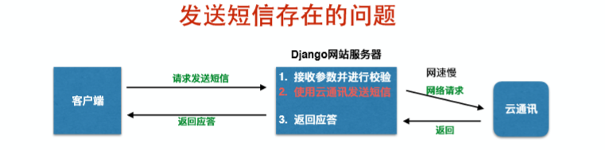
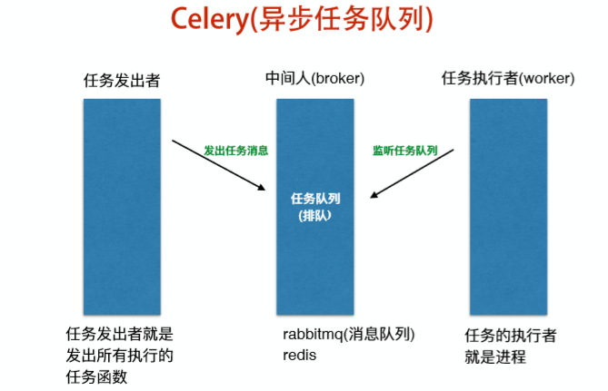

#### 1. 跨域请求

同源策略：对于两个url地址，如果`协议`、`ip`和`端口`完全一致，那么这两个地址是同源的。

浏览器器在发起ajax强求时，如果当前页面的地址和被请求的地址不是同源的，那么这个请求就属于跨域请求。

浏览器在发起ajax跨域请求时，会在请求头中添加请求头`Orign`

> Orgin: 源请求地址

服务器在收到请求时，如果允许源请求地址进行跨域请求，需要在响应头中添加响应头`Access-Control-Allow-Origin`

> Access-Control-Allow-Origin: 源请求地址

浏览器在收到服务器响应时，就会查看响应头中是否有`Access-Control-Allow-Origin:源地址`如果没有，就认为被请求的服务器不允许源地址进行跨域请求，直接将请求驳回。

#### 2. celery异步任务队列

本质：通过提前创建的进程调用函数实现异步任务



通过之前的技术解决异步发送短信

1）封装发送短信的函数

2）创建进程、线程或协程调用发送短信的函数

问题

1）创建进程和网站服务器在同一台主机

2）调用顺序不确定



* celery中的任务发出者、中间人和任务的执行者可以在不同的电脑上。
* celery中的任务会进行排队，先添加到任务队列中的任务会被worker所执行

使用
1）安装`pip install celery`
2）创建Celery类实例对象并进行相关设置

```python
# main.py
from celery import Celery

# 创建Celery类实例对象
celery_app = Celery('demo')

# 加载配置
celery_app.config.from_object('celery配置文件包路劲')

# config.py
# 设置中间人地址
broker_url = 'redis://127.0.0.1:6379/3'
```

3）封装函数

```python
@celery_app.task(name='deme')
def demo(a, b):
    # 需要执行的任务
```

4）创建celery worker并启动

```python
celery -A 'celery 实例对象所在文件路径' worker -l info
```

5）发送任务消息

```python
demo.delay(1, 3)
```

####3. urllib使用说明

- urllib.parse.urlencode(query)

  将query字典转换为url路径中的查询字符串

- urllib.parse.parse_qs(qs)

  将qs查询字符串格式数据转换为python的字典，值为list

- urllib.request.urlopen(url, data=None)

  发送http请求，如果data为None，发送GET请求，如果data不为None，发送POST请求

  返回response响应对象，可以通过read()读取响应体数据，需要注意读取出的响应体数据为bytes类型

#### 4. 浏览器缓存

* sessionStorage  浏览器关闭即失效
  sessionStorage.变量名 = 值   保存数据

  sessionStorage.变量名  读取数据

  sessionStorage.clear()   清除所有数据

* localStorage 长期有效


#### 5. JWT

> Json web token (JWT) ,是为了在网络应用环境间传递声明而执行的一种基于JSON的开放标准（RFC7519）,该token被设计为紧凑且安全的，特别适合用于分布式站点的单点登录（SSO）场景。JWT的声明一般被用来在身份提供者和服务提供者间传递被认证的用户身份信息，以便于从资源服务器获取资源。也可以增加一些额外的其它业务逻辑所必须的声明信息，该token也可以直接被用于认证，也可以加密

1）头部（header）

* 申明类型

* 申明加密的算法

  ```http
  {
    'typ': 'JWT',
    'alg': 'HS256'
  }
  # 将头部进行base64加密
  ```

2）载荷（payload）

* 标准中注册的声明
* 公共的声明
* 私有的声明

3）签证（signature）

* header（base64）
* payload（base64）
  将base64加密后的header和base64加密后的payload使用`.`连接起来进行加密，然后通过header中声明的加密方式进行加盐`secret`组合加密，然后就构成了jwt的第三部分

> 将这三部分用`.`连接起来就构成了jwt