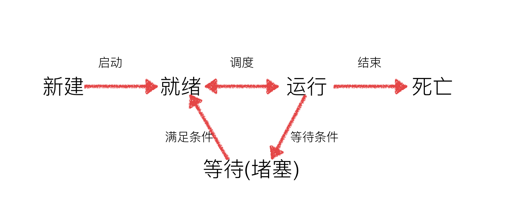

####1. 网络编程

**1) IP地址**

* 私有IP地址

  10.0.0.0 - 10.255.255.255
  172.16.0.0 - 172.31.255.255
  192.168.0.0 - 192.168.255.255

* 本机IP地址
  127.0.0.1  localhost

**2) 套接字**

socket 是进程间通信的一个工具，它能实现将数据从一方传输到另一方，完成不同电脑上进程之间的通信，好比数据的搬运工。

**3) 编码和解码**

* 编码
  str -> bytes: encode(encoding="utf-8", errors="strict")  errors 还可以取ignore 表示在编解码不成功时忽略
* 解码
  bytes -> str: decode(encoding="utf-8", errors="strict")

**4) UDP协议（用户数据报协议）**

* 特点

  - 无连接
    双方在进行通信时，不需要相互建立连接
  - 不可靠
    没有流量控制，发送方不会考虑接收方是否接受成功。
  - 资源开销小，传输速度快
  - 面向数据报的传输层协议

* 数据传输

  ```python
  import socket
  
  # 创建UDP套接字
  udp_socket = socket.socket(socket.AF_INET, socket.SOCK_DGRAM)
  
  # 创建目标地址
  address = ('192.168.138.29', 7878)
  
  # 设置需要发送的数据
  data = 'hello world'
  
  # 编码
  data = data.encode()
  
  # 发送数据
  
  udp_socket.sendto(data, address)
  
  # 接受数据
  recv_data, ip_port = udp_socket.recvfrom(1024)
  print(ip_port)
  # 解码
  recv_data = recv_data.decode('gbk')
  
  print(recv_data)
  
  # 关闭套接字
  udp_socket.close()
  ```

* 绑定端口

  ```python
  local_addr = ('', 7788)
  udp_socket.bind(local_addr)
  ```

* 发送广播消息

  ```python
  import socket
  
  # 创建UDP套接字
  udp_socket = socket.socket(socket.AF_INET, socket.SOCK_DGRAM)
  
  # 创建目标地址
  address = ('192.168.138.255', 7878)
  
  # 设置socket允许发送广播消息
  udp_socket.setsockopt(socket.SOL_SOCKET, socket.SO_BROADCAST, True)
  
  # 设置需要发送的数据
  data = 'hello world'
  
  # 编码
  data = data.encode()
  
  # 发送数据
  
  udp_socket.sendto(data, address)
  
  # 接受数据
  recv_data, ip_port = udp_socket.recvfrom(1024)
  print(ip_port)
  # 解码
  recv_data = recv_data.decode('gbk')
  
  print(recv_data)
  
  # 关闭套接字
  udp_socket.close()
  ```

**5) TCP协议（传输控制协议）**

* 特点

  * 面向连接
    双方在通信前必须先建立连接
  * 可靠传输
    * 发送应答机制
      TCP发送的每个报文段必须得到对方的应答才认为这个TCP报文传输成功
    * 超时重传机制
      发送端发出一个报文之后就开启定时器，如果在给定时间内没有得到应答，发送方就会重新发送这个报文段
    * 流量控制
      TCP有相应的流量控制机制，比如滑动窗口
  * 传输速度慢、资源开销大、适合大量数据传输

* 建立连接

  - 三次握手
    - 第一次
      客户端发送建立连接的请求，SYN=1, 产生随机的一个序列号seq=J ACK=1 发送个服务端，进入SYN_SENT状态
    - 第二次
      服务端收到客户端发送的数据，通过SYN=1知道是要建立连接，服务端将SYN 和 ACK都置为1，并产生一个随机的序列号seq=K，ack=J+1 发送给客户端，进入SYN_RCVD状态
    - 第三次
      客户端接收到数据后，先检查ack是否等于J+1，ACK是否等于1，如果正确，就将ACK=1,将ack=K+1 发送给服务端，服务端接收到数据，并检查后双方建立连接，进入ESTABLISHED状态

* 断开连接

  - 四次挥手
    - 第一次
      客户端发送FIN=1，seq=u，ACK=1 进入FIN-WAIT-1
    - 第二次
      服务端收到后发送ACK=1，seq=v，ack=u+1 客户端进入FIN-WAIT-2 服务端进入CLOSE-WAIT
    - 第三次
      服务端将ACK=1，FIN=1，ACK=1，seq=w，ack=u+1 进入LAST_ACK
    - 第四次
      客户端收到服务端连接释放报文后，必须发出确认ACK=1，ack=w+1，seq=u+1，并进入TIME-WAIT 服务端收到后进入CLOSED状态
      客户端等待2MSL后进入CLOSED状态

* 数据传输

  客户端

  ```python
  # 创建TCP套接字
  tcp_client = socket.socket(socket.AF_INET, socket.SOCK_STREAM)
  
  # 建立连接
  server_ip = '192.168.138.29'
  server_port = 7878
  tcp_client.connect((server_ip, server_port))
  
  # 设置数据
  data = 'hello'
  
  # 编码
  data = data.encode()
  
  # 发送数据
  tcp_client.send(data)
  
  # 接受数据
  recv_data = tcp_client.recv(1024)
  
  
  # 解码
  recv_data = recv_data.decode('gbk')
  print(recv_data)
  
  # 关闭连接
  tcp_client.close()
  ```

  服务器端

  ```python
  # 创建TCP套接字
  tcp_server = socket.socket(socket.AF_INET, socket.SOCK_STREAM)
  
  # 设置立即释放端口
  tcp_server.setsockopt(socket.SOL_SOCKET, socket.SO_REUSEADDR, True)
  
  # 绑定地址
  tcp_server.bind(('', 7878))
  
  # 设置监听
  tcp_server.listen(128)
  
  # 接受客户端请求
  tcp_client, ip_port = tcp_server.accept()
  print(ip_port)
  
  # 接受数据
  recv_data = tcp_client.recv(1024)
  
  
  # 解码
  recv_data = recv_data.decode('gbk')
  print(recv_data)
  
  # 设置数据
  data = 'hello'
  
  # 编码
  data = data.encode()
  
  # 发送数据
  tcp_client.send(data)
  
  # 关闭连接
  tcp_client.close()
  tcp_server.close()
  ```

* 断开连接

  当客户端的套接字调用close后，服务器端会recv解堵塞，并且返回的长度为0，因此服务器可以通过返回数据的长度来区别客户端是否已经下线

#### 2. 多任务

* 并发
  指的是任务数多于CPU核数，通过操作系统的各种调度算法，实现用多个任务“一起”执行（实际上总有一些任务不在执行，因为切换任务的速度相当快，看上去一起执行而已）
* 并行
  指的是任务数小于等于cpu核数，即任务真的是一起执行的

#### 3. 线程

**1) 概念**

> 线程就是在程序运行过程中，执行程序代码的一个分支，每个运行的程序至少都有一个线程。

**2) 线程类`Thread`**

`Thread(group, [target, [name [args, [kwargs]]]])`

* group: 线程组，目前只能使用None
* target: 执行的目标任务名
* args: 以元组的形式给执行任务传参数
* kwargs: 以字典的方式给执行任务传参
* name: 线程名

**3) 多线程**

```python
import threading

def sing():
    for i in range(10):
        print('sing', i)
   
def dance():
    for i in range(10):
        print('dance', i)


sub_thread1 = threading.Thread(target=sing)
sub_thread2 = threading.Thread(target=dance)

sub_thread1.start()
sub_thread2.start()

```

> 查看活动线程列表`threading.enumerate()` 
>
> 获取活动线程的数量 `threading.active_count()`
>
> 提示：
>
> * 线程启动后才会把线程放到活动线程列表里
> * 线程执行完就会销毁，会从活动线程列表里移除这个线程对象

**4) 传参**

* `args=('zhangsan', 18)`
* `kwargs={'name':'zhangsan', age:18}`

**5) 设置守护主线程**

* `Thread(daemon=True)`
* `sub_thread.daemon = True`

**6) 多线程的特点**

* 线程之间执行是无序的
* 主线程会等待所有的子线程结束后才结束
* 线程之间共享变量

**7) 自定义线程**

```python
class MyThread(threading.Thread):
    """自定义线程"""

    def __init__(self, info1, info2):

        super(MyThread, self).__init__()
        self.info1 = info1
        self.info2 = info2


    def test1(self):
        print(self.info1)

    def test2(self):
        print(self.info2)

    def run(self):
        self.test1()
        self.test2()


if __name__ == '__main__':
    my_thread = MyThread('测试1', '测试2')
    my_thread.start()
```

> 自定义线程不能指定target，因为自定义线程里面的任务都是统一在run方法里面执行
>
> 启动线程统一调用start方法，不要直接调用run方法，因为这样不是使用子线程去执行任务

**8) 共享变量**

* 解决共享变量出现数据错误的方法

  > 线程同步: 保证同一时刻只能有一个线程去操作变量

* 实现线程同步的方法

  * 线程等待(join)

    ```python
    g_num = 0
    
    def sum_num1():
        for i in range(1000000):
            global g_num
            g_num +=1
        print('sum1:', g_num)
    
    
    def sum_num2():
        for i in range(1000000):
            global g_num
            g_num +=1
        print('sum2:', g_num)
    
    if __name__ == '__main__':
        sub1 = threading.Thread(target=sum_num1)
        sub2 = threading.Thread(target=sum_num2)
        sub1.start()
        sub1.join()
        sub2.start()
    ```

  * 互斥锁

    ```python
    lock = threading.Lock()
    
    g_num = 0
    
    def sum_num1():
        lock.acquire()
        for i in range(1000000):
            global g_num
            g_num +=1
        print('sum1:', g_num)
        lock.release()
    
    
    def sum_num2():
        lock.acquire()
        for i in range(1000000):
            global g_num
            g_num +=1
        print('sum2:', g_num)
        lock.release()
    
    if __name__ == '__main__':
        sub1 = threading.Thread(target=sum_num1)
        sub2 = threading.Thread(target=sum_num2)
        sub1.start()
        sub2.start()
    ```

* 死锁

  > 避免出现死锁的方法: 注意在适当的位置加锁和释放锁，使用`try...finally ..`

#### 4. 进程

**1) 概念**

> 进程是系统进行资源分配的基本单位，每启动一个进程操作系统都需要为其分配运行资源

**2) 进程状态**



**3) 进程与线程的关系**

> 一个进程默认有一个线程，进程里可以创建线程，线程是依附在进程里面的，没有进程就没有线程

**4) Process进程类**

>  Process([group [, target [, name [, args [, kwargs]]]]])

- group：指定进程组，目前只能使用None
- target：执行的目标任务名
- name：进程名字
- args：以元组方式给执行任务传参
- kwargs：以字典方式给执行任务传参

> Process创建的实例对象的常用方法

- start()：启动子进程实例（创建子进程）
- join([timeout])：是否等待子进程执行结束，或等待多少秒
- terminate()：不管任务是否完成，立即终止子进程
- Process创建的实例对象的常用属性：
- name：当前进程的别名，默认为Process-N，N为从1开始递增的整数
- pid：当前进程的pid（进程号）

**5) 多进程**

```python
import os
import multiprocessing
from time import sleep

def work():

    current = multiprocessing.current_process()

    print('子进程', current)

    print('子进程号', multiprocessing.current_process().pid, os.getpid())

    print('父进程号', os.getppid())

    for _ in range(10):

        print('work...')

        sleep(1)

        os.kill(os.getpid(), 9)


if __name__ == '__main__':

    current = multiprocessing.current_process()

    print('main', current, current.pid)

    sub_process = multiprocessing.Process(target=work)

    sub_process.start()

    for _ in range(10):

        print('main work......')
        sleep(1)
```

**6) 多进程的特点**

* 进程之间不共享变量
* 主进程会等待所有子进程全部结束后再退出
* 可以通过设置sub_process.terminate()结束子进程的执行
* 可以设置守护主进程

**7) 进程池**

```python
import multiprocessing
import time


def work():

    print('复制中...', multiprocessing.current_process().pid)

    time.sleep(1)


if __name__ == '__main__':

    pool = multiprocessing.Pool(3) # 超过CPU核数时，不会多分配

    for i in range(5):

        # pool.apply(work) # 采用同步

        pool.apply_async(work) # 采用异步


    pool.close()

    pool.join()
    
```

> 进程池会根据任务量尽量少的分配进程

**8) 进程间通信**

```python
import multiprocessing

if name == 'main':

    queue = multiprocessing.Queue(3)

    queue.put('zhangsan')

    queue.put([1, 2, 3])

    queue.put(1)

    print(queue.full())

    print('当前队列中消息数', queue.qsize())

    print(queue.get())

    print('当前队列中消息数', queue.qsize())

    print(queue.get())

    print('当前队列中消息数', queue.qsize())

    print(queue.get())
    print('当前队列中消息数', queue.qsize())
```

> **说明**
> 初始化Queue()对象时（例如：q=Queue()），若括号中没有指定最大可接收的消息数量，或数量为负值，那么就代表可接受的消息数量没有上限（直到内存的尽头）；
>
> Queue.qsize()：返回当前队列包含的消息数量；
>
> Queue.empty()：如果队列为空，返回True，反之False , 注意这个操作是不可靠的。
>
> Queue.full()：如果队列满了，返回True,反之False；
>
> Queue.get([block[, timeout]])：获取队列中的一条消息，然后将其从列队中移除，block默认值为True；
>
> 1）如果block使用默认值，且没有设置timeout（单位秒），消息列队如果为空，此时程序将被阻塞（停在读取状态），直到从消息列队读到消息为止，如果设置了timeout，则会等待timeout秒，若还没读取到任何消息，则抛出"Queue.Empty"异常；
>
> 2）如果block值为False，消息列队如果为空，则会立刻抛出"Queue.Empty"异常；
>
> Queue.get_nowait()：相当Queue.get(False)；
>
> Queue.put(item,[block[, timeout]])：将item消息写入队列，block默认值为True；
>
> 1）如果block使用默认值，且没有设置timeout（单位秒），消息列队如果已经没有空间可写入，此时程序将被阻塞（停在写入状态），直到从消息列队腾出空间为止，如果设置了timeout，则会等待timeout秒，若还没空间，则抛出"Queue.Full"异常；
>
> 2）如果block值为False，消息列队如果没有空间可写入，则会立刻抛出"Queue.Full"异常；Queue.put_nowait(item)：相当Queue.put(item, False)；

#### 5. 协程

**1）概念**

> 协程又称微线程，纤程，也称为用户级线程，在不开辟线程的基础上完成多任务，也就是在单线程的情况下完成多任务，多个任务按照一定的顺序交替执行，通俗理解只要在函数中定义了yield关键字表示就是协程

**2）实现**

* 简单实现

  ```python
  import time
  def work1():
      while True:
          print('work1')
          yield 
          time.sleep(0.5)
          
  def work2():
      while True:
          print('work2')
          yield
          time.sleep(0.5)
  
  def main():
      w1 = work1()
      w2 = work2()
      while True:
          next(w1)
          next(w2)
  if __name__ == '__main__':
      main()
  ```

* greenlet

  ```python
  import time
  import greenlet
  
  def work1():
      while True:
          print('work1')
          time.sleep(0.5)
          g2.swith()
          
  def work2():
      while True:
          print('work2')
          time.sleep(0.5)
          g1.switch()
  
  if __name__ == '__main__':
      g1 = greenlet.greenlet(work1)
      g2 = greenlet.greenlet(work2)
      g1.switch()
  ```

* gevent

  ```python
  import gevent
  import time
  from gevent import monkey
  
  # 打补丁，让gevent框架识别耗时操作，比如：time.sleep，网络请求延时
  monkey.patch_all()
  
  
  # 任务1
  def work1(num):
      for i in range(num):
          print("work1....")
          time.sleep(0.2)
          # gevent.sleep(0.2)
  
  # 任务1
  def work2(num):
      for i in range(num):
          print("work2....")
          time.sleep(0.2)
          # gevent.sleep(0.2)
  
  
  
  if __name__ == '__main__':
      # 创建协程指定对应的任务
      g1 = gevent.spawn(work1, 3)
      g2 = gevent.spawn(work2, 3)
  
      # 主线程等待协程执行完成以后程序再退出
      g1.join()
      g2.join()
  ```

* 注意点

  协程默认是开启守护的，在执行时需要阻塞，如果程序不会退出，则不用

**6）线程、进程和协程之间的比较**

* 一个进程至少有一个线程，进程里面可以有多个线程
* 一个线程里面可以有多个协程
* 进程是CPU资源分配的单位
* 线程是操作系统调度的单位

**7）HTTP协议**


