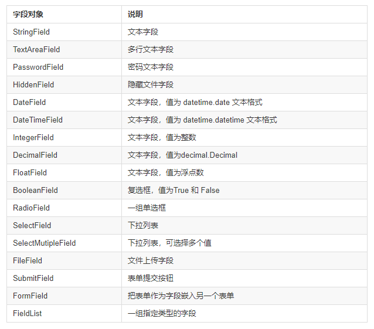

### 模板渲染
* render_template
    ```python
    @app.route('/')
    def index():
        my_dict = {
            'name': '张国鹏'
            'age': 18
        }
        return render_template('index.html',my_dict=my_dict)
    ```

### 过滤器
1. 常见内建过滤器
    * 字符串操作
        - safe：禁用转义
            `<p>{{ '<em>hello</em>' | safe }}</p>`
        - capitalize: 字符串首字母转大写，其余字母转小写
            `<p>{{ 'hello' | capitalize }}</p>`
        - lower: 转小写
        - upper: 转大写
        - title: 每个单词的首字母转大写
        - reverse: 字符串反转
        - format: 格式化输出
            `<p>{{ '%s is %d' | format('name', 17) }}</p>`
        - striptags: 渲染之前把值中所有的HTML标签都删掉
            `<p>'<em>hello</em>' | striptags</p>`
        - truncate: 字符串截断
            `<p>{{ 'hello every one | truncate(9) }}` 真实截取6个字符
    * 列表操作
        - first: 取第一个元素
        - last: 取最后一个元素
        - length: 取列表长度
        - sum: 列表求和
        - sort: 列表排序
    * 其它过滤器
        - default: 设置默认
            `<p>{{ username | default('张国鹏')}}</p>`
2. 自定义过滤器
    * 方法一
        ```
        def do_list_reverse(li):
            temp_li = list(li)
            temp_li.reverse()
            return temp_li
        # 第一个参数是函数名，第二个参数是过滤器名  
        app.add_template_filter(do_list_reverse, 'lireverse')
        ```
    * 方法二
        ```
        @app.template_filter('lireverse')
        def do_list_reverse(li):
            temp_li = list(li)
            temp_li.reverse()
            return temp_li
        ```
3. 语句块过滤
    ```
    
        # 过滤内容
    
    ```

### 控制代码块
1. if语句
    ```
    
        <a href='/logout'>Logout</a>
    
        <a href="/login">Login</a>
    
    ```
2. 循环
    * 示例
        ```
        
            <div>
                <h1>{{ post.title }}</h1>
                <p>{{ post.text | safe }}</p>
            </div>
        
        ```
    * 常用操作
        - `loop.index` 当前循环迭代的次数（从1开始）
        - `loop.index0` （从0开始）
        - `loop.revindex` 到结束需要迭代的次数
        - `loop.revindex0` 
        - `loop.first` 如果是第一次迭代，为True
        - `loop.last` 如果是最后一次迭代，为False
        - `loop.length` 序列中的项目数
        - `loop.cycle` 在一串序列间期取值的辅助函数。
            ```
            
            {{ loop.cycle('odd', 'even')}} {{post.title}}
            
            # odd Post Title
            # even Second Post
            ```

### 模板复用
1. 宏
    * 定义宏
        ```html
        
            <input type="{{ type }}" name="{{ name }}"
                value="{{ value }}" class="form-control"
        
        ```
    * 调用宏
        - 同一文件
            ```html
            
            # <input type="text" name="name"
            #       value="zs" class="form-control"
            ```
        - 导入宏
            ```
            
            
            ```
2. 继承
    * 父模板
        ```html
        # base.html
        
            顶部菜单
        

        
            
        

        
            底部
        
        ```
    * 子模板
        ```
        
        
            需要填充的内容
        
        ```
    * 注意
        - 子模板会将父模板中的block全部继承过来，如果没有修改内容会原样输出，修改后会覆盖掉父模板中的内容。
        - 调用父模板中的内容可以用super()
3. 包含
    ```
    
    # 不存在时忽略
    
    ```

### 特有变量及函数
1. config
    * 直接访问Flaskconfig对象
        `{{ config.SQLALCHEMY_DATABASE_URI }}`
2. request
    * 当前请求的request对象
        `{{ request.url }}`
3. session
    * Flask的session对象
        `{{ session.new }}`
4. g变量
    * 直接访问g变量的属性值
5. url_for()
    * 加载静态文件
        `<link type='text/css href="{{ url_for('static', filename='css/style.css') }} />"`
6. get_flasked_messages()
    * flash()传入的消息队列
        ```
        
            {{ message }}
        
        ```

### Flask-WTF
#### Web表单
1. WTForms支持的HTML标准字段

2. WTForms常用验证函数

3. 使用示例
    * 配置参数，关闭CSRF校验
        `app.config['WTF_CSRF_ENABLED = False`
    * 模板页面
        ```html
        <form method="post">
        {{ form.username.label }}{{ form.username }} <br>
        {{ form.password1.label }}{{ form.password1 }} <br>
        {{ form.password2.label }}{{ form.password2 }} <br>
        {{ form.submit }}
        </form>
        ```
    * 视图函数
        ```python
        from flask import Flask,render_template, flash
        #导入wtf扩展的表单类
        from flask_wtf import FlaskForm
        #导入自定义表单需要的字段
        from wtforms import SubmitField,StringField,PasswordField
        #导入wtf扩展提供的表单验证器
        from wtforms.validators import DataRequired,EqualTo
        ```


~~~python
    app = Flask(__name__)
    app.config['SECRET_KEY']='SECRET_KEY'

    #自定义表单类，文本字段、密码字段、提交按钮
    class RegisterForm(FlaskForm):
        username = StringField("用户名：", validators=[DataRequired()])
        password = PasswordField("密码：", validators=[DataRequired()])
        password2 = PasswordField("确认密码：", validators=[DataRequired(), EqualTo("password")])
        submit = SubmitField("注册")

    #定义根路由视图函数，生成表单对象，获取表单数据，进行表单数据验证
    @app.route('/demo2', methods=["get", "post"])
    def demo2():
        register_form = RegisterForm()
        # 验证表单
        if register_form.validate_on_submit():
            # 如果代码能走到这个地方，那么就代码表单中所有的数据都能验证成功
            username = request.form.get("username")
            password1 = request.form.get("password1")
            password2 = request.form.get("password2")
            # 假装做注册操作
            print(username, password, password2)
            return "success"
        else:
            if request.method == "POST":
                flash("参数有误或者不完整")

        return render_template('temp_register.html', form=register_form)

    if __name__ == '__main__':
        app.run(debug=True)
    ```
~~~
4. 注意
    * 使用Flask-WTF需要配置参数SECRET_KEY
    * 配置WTF_SCRF_ENABLED参数是为了CSRF保护，SECRET_KEY用来生成加密令牌，当CSRF激活时，该配置就会根据设置的密匙生成加密令牌。

### CSRF
1. 定义
    * 全拼`Cross Site Request Forgery`，译为跨站请求伪造。
2. 解释
    * 指攻击者盗用你的身份，以你的名义发送恶意请求。
3. 在Flask项目中解决CSRF攻击
    * 第一种方式
        ```python
        app.secret_key = 'secret key'

        # 模板中
        <form method="post">
            {{ form.csrf_token() }}
            {{ form.username.label }} {{form.username }}
            {{ form.password1.label }} {{ form.password1 }}<br/>
            {{ form.password2.label }} {{ form.password2 }}<br/>
            {{ form.submit }}
        </form>
        ```
    * 第二种方式
        ```python
        from flask.ext.wtf import CSRFProtect
        app.secret_key = "secret key"
        CSRFProtect(app)

        # 如果模板中有表单，不需要做任何事。与第一种方法一样。
        <form method="post">
            {{ form.csrf_token }}
            ...
        </form>

        # 如果模板中没有表单，任然需要CSRF令牌
        <form method="post" action="/">
            <input type="hidden" name="csrf_token" value="{{ csrf_token() }}">
        </form>

        ```